# DaisyAI Agent Ecosystem - Master Architecture & Execution Plan

## **🚨 CRITICAL: LLM DEVELOPMENT INSTRUCTIONS - MANDATORY COMPLIANCE** 

### **⚠️ NON-NEGOTIABLE REQUIREMENTS FOR ALL CODE GENERATION AND SYSTEM ARCHITECTURE**

**🔒 ABSOLUTE COMPLIANCE MANDATE:**
- **ALL code creation, file structure, and system architecture MUST strictly follow Google Agent Starter Pack (ASP) 0.5.2 code-as-infrastructure methodology**
- **This is NOT a recommendation - this is a MANDATORY requirement**
- **Every single code commit, file creation, and structural decision MUST be 100% compliant with ASP 0.5.2 standards**
- **Any deviation from ASP code-as-infrastructure principles is considered a critical failure**

**📋 MANDATORY COMPLIANCE REPOSITORIES:**
- **Agent Starter Pack (ASP) 0.5.2**: https://github.com/GoogleCloudPlatform/agent-starter-pack
- **A2A Protocol**: https://github.com/google-a2a/A2A

**🔐 CODE-AS-INFRASTRUCTURE REQUIREMENTS:**
1. **Agent Creation**: ONLY use `agent-starter-pack create <name> -d agent_engine -a <template>`
2. **Template Compliance**: ONLY use official ASP 0.5.2 templates (agentic_rag, langgraph_base_react, adk_base, live_api)
3. **Directory Structure**: MUST follow exact ASP 0.5.2 directory conventions
4. **Dependencies**: MUST use exact ASP 0.5.2 dependency specifications
5. **Deployment**: MUST use Google Cloud Agent Engine deployment targets
6. **Authentication**: MUST use Google OAuth 2.0/OIDC as specified in ASP
7. **Communication**: MUST implement A2A protocol specifications exactly as documented

**✅ VERIFICATION REQUIREMENTS:**
- **Pre-commit**: Every code change MUST be verified against ASP 0.5.2 standards
- **Template Validation**: All agents MUST be generated using official ASP CLI
- **Structure Compliance**: File structure MUST match ASP repository examples exactly
- **Documentation Alignment**: All code MUST align with official ASP documentation
- **No Custom Solutions**: Do NOT create custom implementations when ASP solutions exist

**🚫 PROHIBITED ACTIONS:**
- ❌ Creating agents without using `agent-starter-pack create` command
- ❌ Modifying ASP 0.5.2 template structures
- ❌ Using non-ASP directory conventions
- ❌ Implementing custom authentication when ASP provides it
- ❌ Deviating from official A2A protocol specifications
- ❌ Creating manual file structures instead of using ASP CLI
- ❌ Using non-Google Cloud deployment targets

**📊 COMPLIANCE VERIFICATION CHECKLIST:**
Before any code commit, verify:
- [ ] ✅ Agent created with official ASP CLI command
- [ ] ✅ Template matches official ASP 0.5.2 specification
- [ ] ✅ Directory structure exactly matches ASP examples
- [ ] ✅ Dependencies align with ASP requirements
- [ ] ✅ A2A protocol implementation follows official specs
- [ ] ✅ Authentication uses Google OAuth 2.0/OIDC
- [ ] ✅ Deployment targets Google Cloud Agent Engine
- [ ] ✅ No custom implementations where ASP solutions exist

**🎯 SUCCESS CRITERIA:**
- **All agents start successfully with `uv run adk web --port XXXX`**
- **Zero "No root_agent found" errors**
- **Perfect ASP 0.5.2 template compliance**
- **100% A2A protocol adherence**
- **Full Google Cloud Agent Engine compatibility**
- **Complete testing suite passing all evaluation criteria**

---

## **Executive Summary**

This document outlines the complete architecture and phased execution plan for the DaisyAI multi-agent system, designed for music industry business process automation. The system will feature 11 specialized agents built on Google Agent Starter Pack 0.5.2 with A2A protocol integration, LangGraph orchestration, and centralized data access.

## **Architecture Decisions**

### **Data Layer Architecture**
- **Primary Approach**: Centralized data layer through Vertex AI Search
- **Neo4j Integration**: Read-only access via Vertex AI Search federation
- **Benefits**: Simplified agent design, better error handling, ASP compliance
- **Agent Access**: Universal access through single Vertex AI Search endpoint

### **Communication Architecture** 
- **A2A Protocol**: Agent-to-agent communication with agent cards (`/.well-known/agent.json`)
- **LangGraph**: Complex workflow orchestration for multi-agent coordination
- **Streaming**: Preserved for user interactions, batch coordination for complex workflows
- **Authentication**: OAuth 2.0/OIDC across ecosystem

### **Template Strategy**
- **ASP 0.5.2 Compliance**: Perfect adherence to official templates from [GoogleCloudPlatform/agent-starter-pack](https://github.com/GoogleCloudPlatform/agent-starter-pack)
- **A2A Protocol**: Full integration with [google-a2a/A2A](https://github.com/google-a2a/A2A) specifications
- **Discovery**: Hybrid ASP + A2A approach
- **Clean Slate**: Complete rebuild for template compliance

### **ASP 0.5.2 CLI Integration**
- **Installation**: `pip install agent-starter-pack` (latest 0.5.2)
- **Agent Creation**: `agent-starter-pack create <agent-name> -d agent_engine -a <template>`
- **Deployment Target**: Google Cloud Agent Engine (fully managed)
- **Infrastructure**: Production-ready with monitoring, observability, CI/CD

## **System Architecture Overview**

```mermaid
graph TB
    subgraph "DaisyAI Agent Ecosystem - ASP 0.5.2 Compliant"
        subgraph "Phase 1: Foundation (Weeks 1-2)"
            DK["🎵 daisy-knowledge<br/>(agentic_rag)<br/>Document RAG + Streaming"]
            DM["🎯 daisy-maestro<br/>(langgraph_base_react)<br/>Orchestration + Batch"]
        end
        
        subgraph "Phase 2: Music Business Core (Weeks 3-4)"
            DT["🔍 daisy-talent<br/>(adk_base)<br/>A&R Discovery"]
            DP["🎼 daisy-production<br/>(adk_base)<br/>Music Generation"]
            DMK["📢 daisy-marketing<br/>(adk_base)<br/>Campaign Management"]
            DL["🎤 daisy-live<br/>(live_api)<br/>Real-time Performance"]
        end
        
        subgraph "Phase 3: Business Operations (Weeks 5-6)"
            DV["🏟️ daisy-venue<br/>(adk_base)<br/>Logistics"]
            DR["⚖️ daisy-rights<br/>(adk_base)<br/>Rights Management"]
            DLE["📋 daisy-legal<br/>(adk_base)<br/>Legal Compliance"]
            DF["💰 daisy-financial<br/>(adk_base)<br/>Financial Analysis"]
            DA["👥 daisy-audience<br/>(adk_base)<br/>Audience Intelligence"]
        end
    end
    
    subgraph "Centralized Data Layer"
        VAS["🔍 Vertex AI Search<br/>Central Data Hub<br/>PROJECT_ID: daisy-ai-staging<br/>DATA_STORE_ID: daisy-knowledge-datastore-v2"]
        NEO["🗃️ Neo4j Aura<br/>Knowledge Graph<br/>Read-Only Access<br/>neo4j+s://...endpoints.neo4j.io"]
        
        VAS <--> NEO
    end
    
    subgraph "A2A Protocol Integration (Phase 4)"
        AC["🔗 Agent Cards<br/>/.well-known/agent.json"]
        AUTH["🔐 OAuth 2.0/OIDC<br/>Google Authentication"]
        MSG["💬 JSON-RPC Messaging<br/>SSE Streaming"]
    end
    
    subgraph "Infrastructure as Code"
        TF["📦 Terraform<br/>GCP Infrastructure"]
        CB["🔄 Cloud Build<br/>CI/CD Pipeline"]
        GCE["☁️ Google Cloud<br/>Agent Engine"]
    end
    
    %% Data Layer Connections
    DK --> VAS
    DM --> VAS
    DT --> VAS
    DP --> VAS
    DMK --> VAS
    DL --> VAS
    DV --> VAS
    DR --> VAS
    DLE --> VAS
    DF --> VAS
    DA --> VAS
    
    %% A2A Connections
    DM --> AC
    DM --> AUTH
    DM --> MSG
    
    %% Infrastructure Connections
    DK --> GCE
    DM --> GCE
    DT --> GCE
    DP --> GCE
    DMK --> GCE
    DL --> GCE
    DV --> GCE
    DR --> GCE
    DLE --> GCE
    DF --> GCE
    DA --> GCE
    
    TF --> GCE
    CB --> GCE
```



## **Complete Agent Ecosystem (11 Agents)**

### **🏗️ Detailed Agent Components**

| **Agent** | **ASP Template** | **Ontology Class** | **Port** | **Primary Function** | **Phase** | **Data Sources** | **Special Features** |
|-----------|------------------|-------------------|----------|---------------------|-----------|------------------|---------------------|
| `daisy-maestro` | `langgraph_base_react` | MaestroAI | 8501 | Strategic orchestration, goal setting, simulations | 1 | Vertex AI Search + Neo4j | Batch workflows, LangGraph coordination |
| `daisy-knowledge` | `agentic_rag` | KnowledgeBase | 8502 | Document RAG, ontology queries | 1 | Vertex AI Search + Neo4j | Streaming responses, central intelligence |
| `daisy-talent` | `adk_base` | TalentAIScout | 8503 | A&R discovery, artist analysis | 2 | Vertex AI Search + Spotify API | Streaming discovery, talent pipeline |
| `daisy-production` | `adk_base` | ProductionAIGenerator | 8504 | Music generation, remixing | 2 | Vertex AI Search + Audio APIs | Audio streaming, generation tools |
| `daisy-marketing` | `adk_base` | MarketingAIOptimizer | 8505 | Campaign management, optimization | 2 | Vertex AI Search + Social APIs | Campaign streaming, analytics |
| `daisy-live` | `live_api` | LivePerformanceAI | 8506 | Real-time performance streaming | 2 | Vertex AI Search + Live APIs | Real-time streaming, low latency |
| `daisy-venue` | `adk_base` | VenuAILogistics | 8507 | Tour logistics, venue booking | 3 | Vertex AI Search + Venue APIs | Logistics streaming, booking |
| `daisy-rights` | `adk_base` | RightsAdminAI | 8508 | Rights management, royalties | 3 | Vertex AI Search + PRO APIs | Rights streaming, compliance |
| `daisy-legal` | `adk_base` | LegalComplianceAI | 8509 | Legal compliance, contracts | 3 | Vertex AI Search + Legal DBs | Document streaming, compliance |
| `daisy-financial` | `adk_base` | FinancialAnalysisAI | 8510 | Financial planning, forecasting | 3 | Vertex AI Search + Financial APIs | Analytics streaming, reporting |
| `daisy-audience` | `adk_base` | AudienceIntelligenceAI | 8511 | Audience analysis, fan behavior | 3 | Vertex AI Search + Analytics APIs | Insights streaming, segmentation |

### **🔧 Infrastructure Components**

| **Component** | **Technology** | **Purpose** | **Configuration** | **Phase** |
|---------------|----------------|-------------|-------------------|-----------|
| **Data Layer** | Vertex AI Search | Central data hub | `DATA_STORE_ID=daisy-knowledge-datastore-v2` | 1 |
| **Knowledge Graph** | Neo4j Aura | Relationships & ontology | `neo4j+s://...endpoints.neo4j.io` (Read-only) | 1 |
| **Orchestration** | LangGraph | Multi-agent workflows | Integrated with daisy-maestro | 2 |
| **Authentication** | OAuth 2.0/OIDC | Google-based auth | Across all agents | 4 |
| **Communication** | A2A Protocol | Agent-to-agent messaging | `/.well-known/agent.json` | 4 |
| **Deployment** | Cloud Agent Engine | Production hosting | GCP-based infrastructure | 4 |
| **CI/CD** | Cloud Build | Automated deployment | Terraform + pipeline automation | 4 |
| **Monitoring** | Cloud Operations | Observability & logging | Full stack monitoring | 4 |

### **📋 ASP Template Compliance Matrix**

| **Template** | **Agents Using** | **Key Features** | **Compliance Status** |
|--------------|------------------|------------------|----------------------|
| `agentic_rag` | daisy-knowledge (1) | Document retrieval, streaming responses | ✅ ASP 0.5.2 Ready |
| `langgraph_base_react` | daisy-maestro (1) | Complex workflows, batch processing | ✅ ASP 0.5.2 Ready |
| `adk_base` | 8 specialist agents | Core agent functionality, streaming | ✅ ASP 0.5.2 Ready |
| `live_api` | daisy-live (1) | Real-time streaming, low latency | ✅ ASP 0.5.2 Ready |

### **🚀 Deployment Architecture**

| **Environment** | **Project ID** | **Region** | **Agent Engine** | **Data Store** |
|-----------------|----------------|------------|------------------|----------------|
| **Staging** | `daisy-ai-staging` | `us-central1` | Development testing | `daisy-knowledge-datastore-v2` |
| **Production** | `daisy-ai-production` | `us-central1` | Production deployment | TBD (Phase 4) |

## **4-Phase Master Execution Plan**

### **Phase 1 (Week 1-2): Foundation Infrastructure**
**Objective**: Establish core infrastructure and base agents

**Tasks**:
- [ ] Remove non-compliant agents from OntologyV3
- [ ] Install ASP 0.5.2: `pip install agent-starter-pack`
- [ ] Create daisy-knowledge: `agent-starter-pack create daisy-knowledge -d agent_engine -a agentic_rag`
- [ ] Create daisy-maestro: `agent-starter-pack create daisy-maestro -d agent_engine -a langgraph_base_react`
- [ ] Configure centralized Vertex AI Search + Neo4j data layer
- [ ] Implement environment variables and authentication
- [ ] Test root_agent discovery and basic functionality
- [ ] Prepare A2A agent cards structure (`/.well-known/agent.json`)

**Success Criteria**:
- Both agents functional with proper ASP structure
- Centralized data access working
- No "root_agent not found" errors
- Basic agent communication established
- A2A agent discovery framework ready

### **Phase 2 (Week 3-4): Music Business Core**
**Objective**: Build core music industry agents

**Tasks**:
- [ ] Create daisy-talent: `agent-starter-pack create daisy-talent -d agent_engine -a adk_base`
- [ ] Create daisy-production: `agent-starter-pack create daisy-production -d agent_engine -a adk_base`
- [ ] Create daisy-marketing: `agent-starter-pack create daisy-marketing -d agent_engine -a adk_base`  
- [ ] Create daisy-live: `agent-starter-pack create daisy-live -d agent_engine -a live_api`
- [ ] Configure specialized APIs (Spotify, audio generation, social media)
- [ ] Implement LangGraph coordination between agents
- [ ] Test inter-agent communication via A2A protocol

**Success Criteria**:
- 6 agents operational (maestro, knowledge, talent, production, marketing, live)
- API integrations functional
- LangGraph workflows operational
- Streaming UX preserved
- A2A inter-agent communication working

### **Phase 3 (Week 5-6): Business Operations**
**Objective**: Complete agent ecosystem

**Tasks**:
- [ ] Create daisy-venue: `agent-starter-pack create daisy-venue -d agent_engine -a adk_base`
- [ ] Create daisy-rights: `agent-starter-pack create daisy-rights -d agent_engine -a adk_base`
- [ ] Create daisy-legal: `agent-starter-pack create daisy-legal -d agent_engine -a adk_base`
- [ ] Create daisy-financial: `agent-starter-pack create daisy-financial -d agent_engine -a adk_base`
- [ ] Create daisy-audience: `agent-starter-pack create daisy-audience -d agent_engine -a adk_base`
- [ ] Configure business APIs (venue booking, rights organizations, legal databases)
- [ ] Complete 11-agent ecosystem testing
- [ ] Implement external feeds with adaptive rate limiting

**Success Criteria**:
- All 11 agents operational
- Complete business process coverage
- Full ecosystem integration testing
- Performance optimization
- External feeds with intelligent caching operational

### **Phase 4 (Week 7-8): A2A Integration & Deployment**
**Objective**: Production deployment with full A2A protocol

**Tasks**:
- [ ] Implement A2A agent cards for all agents (`/.well-known/agent.json`)
- [ ] Add OAuth 2.0/OIDC authentication across ecosystem
- [ ] Configure JSON-RPC messaging with SSE streaming
- [ ] Production deployment to Google Cloud Agent Engine
- [ ] Implement Cloud Operations monitoring and observability
- [ ] Create Terraform infrastructure as code
- [ ] Full system integration testing with A2A protocol
- [ ] Performance benchmarking and optimization

**Success Criteria**:
- A2A protocol integration complete
- Production deployment successful
- Infrastructure as Code ready
- Full monitoring and observability
- Performance SLAs met

## **Technical Specifications**

### **Environment Configuration**
```bash
# Core Configuration
PROJECT_ID=daisy-ai-staging
DATA_STORE_ID=daisy-knowledge-datastore-v2
DATA_STORE_REGION=us

# Neo4j Configuration  
NEO4J_URI=neo4j+s://neo4j-custom-endpoint-mqhh-b774.endpoints.neo4j.io
NEO4J_USERNAME=neo4j
NEO4J_DATABASE=neo4j
NEO4J_PASSWORD=[Per Environment]

# ASP Configuration
ASP_VERSION=0.5.2
GOOGLE_ADK_VERSION=1.2.0
AIPLATFORM_VERSION=1.95.1

# Port Assignments (8501-8511)
DAISY_MAESTRO_PORT=8501
DAISY_KNOWLEDGE_PORT=8502
DAISY_TALENT_PORT=8503
DAISY_PRODUCTION_PORT=8504
DAISY_MARKETING_PORT=8505
DAISY_LIVE_PORT=8506
DAISY_VENUE_PORT=8507
DAISY_RIGHTS_PORT=8508
DAISY_LEGAL_PORT=8509
DAISY_FINANCIAL_PORT=8510
DAISY_AUDIENCE_PORT=8511
```

### **Dependencies & Technology Stack**
```toml
[tool.uv.dependencies]
# ASP 0.5.2 Core Dependencies (Official from GoogleCloudPlatform/agent-starter-pack)
agent-starter-pack = "~0.5.2"
google-adk = "~1.2.0"
google-cloud-aiplatform = {version = "~1.95.1", extras = ["agent-engines"]}

# A2A Protocol Integration (from google-a2a/A2A repository)
google-a2a = "latest"

# LangGraph for Multi-Agent Orchestration
langgraph = "latest"
langgraph-checkpoint = "latest"

# Data & Search Infrastructure
google-cloud-discoveryengine = "latest"
neo4j = "~5.0"

# MCP Integration for External Feeds
google-cloud-mcp-toolbox = "latest"

# Rate Limiting & Caching for External APIs
aiohttp-rate-limiter = "latest"
redis = "latest"

# Development & Testing
pytest = "^7.0"
pytest-asyncio = "^0.21"
pytest-mock = "^3.10"
uv = "latest"
```

### **Infrastructure Stack**
| **Component** | **Technology** | **Purpose** | **Configuration** |
|---------------|----------------|-------------|-------------------|
| **Agent Runtime** | Google Cloud Agent Engine | Production hosting | GCP-based serverless |
| **CI/CD Pipeline** | Cloud Build | Automated deployment | Terraform + YAML configs |
| **Infrastructure as Code** | Terraform | GCP resource management | Modular tf files |
| **Monitoring** | Cloud Operations Suite | Observability & logging | APM + logging + metrics |
| **Networking** | VPC + Load Balancers | Traffic management | Regional deployment |
| **Security** | IAM + Service Accounts | Access control | Least privilege model |

## **Progress Tracking**

### **Current Status**: ✅ Planning Complete, Ready for Phase 1
- ✅ Architecture designed and documented
- ✅ Agent ontology mapped to ASP templates
- ✅ Data layer strategy defined
- ✅ 4-phase execution plan created
- ⏳ Awaiting implementation approval

### **Success Metrics**
- **Technical**: ASP 0.5.2 compliance, A2A integration, streaming preservation
- **Business**: Complete music industry process coverage
- **Operational**: Production deployment, monitoring, scalability

## **Risk Mitigation**

### **Known Issues**
- Port binding conflicts (8501-8507) - Use dynamic port allocation
- Root_agent discovery errors - Clean ASP structure implementation
- Neo4j connection issues - Centralized data layer approach

### **Contingency Plans**
- Template issues: Fallback to official ASP examples
- Data layer problems: Direct Neo4j integration as backup
- A2A integration delays: Phase 4 can be deferred

## **Documentation Strategy**

### **Artifacts to Maintain**
- [ ] Phase completion reports
- [ ] Agent configuration documentation
- [ ] API integration guides
- [ ] Deployment runbooks
- [ ] Architecture decision records (ADRs)

### **Version Control**
- All progress tracked in git commits
- Feature branches for each phase
- Tagged releases for major milestones
- Continuous integration validation

## **MCP Integration Architecture**

### **Model Context Protocol (MCP) Strategy**
- **Primary Approach**: Vertex AI native MCP tools with A2A protocol integration
- **Context Federation**: Centralized context aggregation through MCP servers
- **Benefits**: Standardized context access, real-time data feeds, ASP compliance
- **Implementation**: MCP servers for Neo4j, Vertex Search, Google Maps, and databases

### **MCP + A2A Hybrid Pattern**

```mermaid
graph TB
    subgraph "MCP Layer"
        MCP_NEO["🗃️ Neo4j MCP Server"]
        MCP_VS["🔍 Vertex Search MCP"]
        MCP_MAPS["🗺️ Google Maps MCP"]
        MCP_DB["💾 Database Toolbox MCP"]
    end
    
    subgraph "A2A Communication"
        A2A_DISC["🔗 Agent Discovery"]
        A2A_AUTH["🔐 OAuth 2.0/OIDC"]
        A2A_MSG["📡 JSON-RPC + SSE"]
    end
    
    subgraph "Agents"
        DK["🎵 daisy-knowledge"]
        DM["🎯 daisy-maestro"]
        DT["🔍 daisy-talent"]
    end
    
    DK --> MCP_NEO
    DK --> MCP_VS
    DM --> MCP_MAPS
    DT --> MCP_DB
    
    DK <--> A2A_DISC
    DM <--> A2A_DISC
    DT <--> A2A_DISC
```


### **MCP Server Configuration**
```yaml
mcp:
  servers:
    neo4j-readonly-mcp:
      endpoint: "http://localhost:8601"
      transport: "sse"
      auth: "oauth2"
      description: "Read-only music ontology access"
    
    vertex-search-mcp:
      endpoint: "internal://vertex-search"
      transport: "native"
      description: "Federated document search"
    
    google-maps-mcp:
      endpoint: "internal://maps-api"
      transport: "native"
      description: "Geospatial context and venue data"
    
    database-toolbox-mcp:
      endpoint: "http://localhost:8602"
      transport: "sse"
      auth: "oauth2"
      description: "Universal database access"
```

### **External Feeds Integration via MCP**

**✅ SUPPORTED: Real-time External API Federation**

**Implementation Timeline**: Infrastructure in Phase 1, Implementation in Phase 3

MCP supports federation of external music industry data sources for expert real-time decision making:

**🎵 Streaming Platforms:**
- **Spotify Web API**: Real-time streaming data, artist analytics, playlist insights
- **YouTube Data API**: Music videos, view analytics, comment sentiment
- **Apple Music API**: Catalog data, charts, artist information
- **SoundCloud API**: Emerging artist discovery, track analytics

**📱 Social Media Feeds:**
- **TikTok API**: Viral trends, music usage analytics, creator insights
- **Instagram API**: Artist posts, story analytics, music features
- **Twitter/X API**: Real-time mentions, sentiment analysis, trending topics

**🎼 Industry Data Sources:**
- **MusicBrainz**: Metadata, artist relationships, release information
- **Chartmetric**: Music analytics, market insights, trend analysis
- **Songkick API**: Concert data, tour schedules, venue information
- **Last.fm API**: User listening patterns, scrobbling data

**Implementation Architecture:**
```python
# External Feed MCP Server Configuration
class ExternalFeedsMCPServer:
    def __init__(self):
        self.clients = {
            'spotify': SpotifyWebAPI(client_id=env.SPOTIFY_CLIENT_ID),
            'youtube': YouTubeDataAPI(api_key=env.YOUTUBE_API_KEY),
            'tiktok': TikTokAPI(access_token=env.TIKTOK_ACCESS_TOKEN),
            'chartmetric': ChartmetricAPI(api_key=env.CHARTMETRIC_API_KEY)
        }
        self.rate_limiters = self._setup_adaptive_rate_limiting()
        self.cache_manager = self._setup_intelligent_caching()
    
    def _setup_adaptive_rate_limiting(self):
        """Configure adaptive rate limiting to balance real-time data freshness with API cost control"""
        return {
            'spotify': AdaptiveRateLimiter(
                base_rate=100,  # requests per minute
                burst_allowance=20,
                cost_threshold=0.80,  # Reduce rate at 80% cost budget
                freshness_requirement='high'  # Real-time for trending data
            ),
            'youtube': AdaptiveRateLimiter(
                base_rate=10000,  # quota units per day
                burst_allowance=1000,
                cost_threshold=0.75,
                freshness_requirement='medium'  # Cache for 15 minutes
            ),
            'tiktok': AdaptiveRateLimiter(
                base_rate=1000,  # requests per day
                burst_allowance=50,
                cost_threshold=0.90,  # Very conservative
                freshness_requirement='high'  # Viral content changes rapidly
            ),
            'chartmetric': AdaptiveRateLimiter(
                base_rate=500,  # paid tier limits
                burst_allowance=25,
                cost_threshold=0.85,
                freshness_requirement='low'  # Daily analytics updates
            )
        }
    
    def _setup_intelligent_caching(self):
        """Configure intelligent caching to optimize data freshness vs API costs"""
        return IntelligentCacheManager(
            cache_policies={
                'trending_data': CachePolicy(ttl=300, priority='high'),      # 5 min for trending
                'artist_metadata': CachePolicy(ttl=3600, priority='medium'), # 1 hour for metadata
                'chart_data': CachePolicy(ttl=7200, priority='low'),         # 2 hours for charts
                'viral_content': CachePolicy(ttl=600, priority='high'),      # 10 min for viral
                'market_insights': CachePolicy(ttl=14400, priority='low')    # 4 hours for insights
            },
            cost_optimization=True,
            adaptive_refresh=True  # Refresh based on usage patterns
        )
    
    async def get_real_time_context(self, query: dict):
        """Federate real-time data from multiple external sources with intelligent caching"""
        # Check cache first
        cached_results = await self.cache_manager.get_cached_context(query)
        if cached_results.is_fresh_enough():
            return cached_results.data
        
        # Apply adaptive rate limiting
        tasks = []
        for client_name, client in self.clients.items():
            if self.rate_limiters[client_name].can_make_request():
                tasks.append(self._fetch_with_fallback(client_name, client, query))
        
        results = await asyncio.gather(*tasks, return_exceptions=True)
        
        # Update cache with new data
        await self.cache_manager.update_cache(query, results)
        return results
    
    async def _fetch_with_fallback(self, client_name: str, client, query: dict):
        """Fetch data with intelligent fallback to cached data if rate limited"""
        try:
            return await client.get_data(query)
        except RateLimitExceededError:
            # Fall back to cached data with extended TTL
            return await self.cache_manager.get_stale_cache(client_name, query, 
                                                          max_staleness=3600)
```

**🔧 Adaptive Rate Limiting Strategy:**

**Cost Control Mechanisms:**
- **Dynamic Rate Adjustment**: Automatically reduce request rates when approaching budget limits
- **Priority-Based Throttling**: Critical real-time data (trending, viral) gets priority during rate limiting
- **Burst Protection**: Prevent cost spikes during high-demand periods
- **Budget Monitoring**: Track daily/monthly API costs across all external services

**Data Freshness Optimization:**
- **Tiered Caching**: Different TTL policies based on data type and importance
- **Adaptive Refresh**: Intelligent cache invalidation based on usage patterns
- **Stale Data Fallback**: Serve slightly outdated data when rate limited vs no data
- **Predictive Prefetching**: Cache likely-needed data during low-cost periods

**Real-time vs Cost Balance:**
- **High Priority** (5-10min cache): Trending music, viral TikTok content, live streaming data
- **Medium Priority** (1-4hour cache): Artist metadata, playlist changes, social engagement
- **Low Priority** (4-24hour cache): Historical charts, market insights, demographic data

**Benefits for Expert Decision Making:**
- **A&R Discovery**: Real-time streaming numbers, viral content detection
- **Marketing Optimization**: Social sentiment, platform-specific engagement
- **Live Performance**: Venue data, fan location analytics, market trends
- **Rights Management**: Usage tracking across platforms
- **Financial Analysis**: Revenue streams, market positioning data

---

**Last Updated**: {current_date}
**Next Review**: Phase 1 completion
**Stakeholders**: Development team, Architecture review board 

### **ASP 0.5.2 Template Specifications**
Based on [GoogleCloudPlatform/agent-starter-pack](https://github.com/GoogleCloudPlatform/agent-starter-pack):

| **Template** | **Description** | **Use Case** | **Features** |
|--------------|-----------------|--------------|--------------|
| `agentic_rag` | RAG agent for document retrieval and Q&A | Knowledge management | Vertex AI Search, Vector Search support |
| `langgraph_base_react` | Base ReAct agent using LangGraph | Multi-agent orchestration | Complex workflows, batch processing |
| `adk_base` | Base ReAct agent using Google's ADK | General purpose agents | Core agent functionality, streaming |
| `live_api` | Real-time multimodal RAG agent | Live interactions | Audio/video/text chat, low latency |
| `crewai_coding_crew` | Multi-agent system with CrewAI | Coding activities | Team-based workflows |

### **A2A Protocol Specifications**
Based on [google-a2a/A2A](https://github.com/google-a2a/A2A) repository:

**Agent Discovery:**
- Agent cards at `/.well-known/agent.json`
- JSON-RPC messaging protocol
- OAuth 2.0/OIDC authentication
- SSE streaming for real-time communication

**Communication Flow:**
```json
{
  "agent": {
    "name": "daisy-knowledge",
    "version": "1.0.0",
    "description": "DaisyAI Knowledge Agent",
    "capabilities": ["document-retrieval", "ontology-search"],
    "endpoints": {
      "rpc": "https://daisy-knowledge.example.com/rpc",
      "stream": "https://daisy-knowledge.example.com/stream"
    },
    "auth": {
      "type": "oauth2",
      "provider": "google"
    }
  }
}
```

### **Infrastructure Stack**
```bash
# Core Configuration
PROJECT_ID=daisy-ai-staging
DATA_STORE_ID=daisy-knowledge-datastore-v2
DATA_STORE_REGION=us

# Neo4j Configuration  
NEO4J_URI=neo4j+s://neo4j-custom-endpoint-mqhh-b774.endpoints.neo4j.io
NEO4J_USERNAME=neo4j
NEO4J_DATABASE=neo4j
NEO4J_PASSWORD=[Per Environment]

# ASP Configuration
ASP_VERSION=0.5.2
GOOGLE_ADK_VERSION=1.2.0
AIPLATFORM_VERSION=1.95.1

# Port Assignments (8501-8511)
DAISY_MAESTRO_PORT=8501
DAISY_KNOWLEDGE_PORT=8502
DAISY_TALENT_PORT=8503
DAISY_PRODUCTION_PORT=8504
DAISY_MARKETING_PORT=8505
DAISY_LIVE_PORT=8506
DAISY_VENUE_PORT=8507
DAISY_RIGHTS_PORT=8508
DAISY_LEGAL_PORT=8509
DAISY_FINANCIAL_PORT=8510
DAISY_AUDIENCE_PORT=8511
```

## **ASP 0.5.2 Testing Framework Integration**

### **🧪 Comprehensive Testing Strategy**
Based on [GoogleCloudPlatform/agent-starter-pack](https://github.com/GoogleCloudPlatform/agent-starter-pack) testing methodology:

#### **1. 🏗️ Core Testing Commands (Makefile)**
Every agent MUST support these standardized commands:
- `make test` - Run complete test suite (unit + integration + evaluation)
- `make playground` - Start local development playground
- `make evaluate` - Run Vertex AI evaluation and benchmarking
- `make deploy` - Deploy to Google Cloud Agent Engine
- `make setup-cicd` - Initialize CI/CD pipeline (automated workflow)

#### **2. 🎮 Agent Testing Tool Methodology**
**CRITICAL: Two distinct testing interfaces based on ASP template type**

**ADK-Based Agents** (`agentic_rag`, `adk_base` templates):
- **Testing Tool**: ADK Web UI
- **Command**: `make playground` → `uv run adk web --port 8501`
- **Directory Requirement**: MUST run from agent directory (e.g., `/agents/daisy-knowledge/`)
- **URL Format**: `http://localhost:PORT/dev-ui/?app=app`
- **App Discovery**: ADK treats `app/` subdirectory as app name
- **Examples**: 
  - `daisy-knowledge`: http://localhost:8502/dev-ui/?app=app
  - `daisy-talent`: http://localhost:8503/dev-ui/?app=app

**LangGraph-Based Agents** (`langgraph_base_react` template):
- **Testing Tool**: Streamlit UI  
- **Command**: `make playground` → `uv run streamlit run frontend/streamlit_app.py`
- **Directory Requirement**: MUST run from agent directory (e.g., `/agents/daisy-maestro/`)
- **URL Format**: `http://localhost:PORT`
- **Examples**:
  - `daisy-maestro`: http://localhost:8501

**MANDATORY TESTING PROCEDURE**:
1. Navigate to agent directory: `cd /path/to/agents/[agent-name]/`
2. Set environment variables: `export PROJECT_ID=daisy-ai-staging`
3. Run playground: `make playground`
4. Access correct URL based on template type
5. Never run `make playground` from root directory (will fail)

#### **2. 🔄 CI/CD Workflow Monitoring** 
**PRIORITY LEVEL 1: Critical Infrastructure**
✅ **Automated Setup**: `uvx agent-starter-pack setup-cicd` (Successfully tested yesterday)
- [ ] **Cloud Build Pipeline Monitoring**:
  - [ ] Build success/failure rates tracked in BigQuery
  - [ ] Deployment rollback automation on failure
  - [ ] Stage-gate approvals for production deployment
  - [ ] Parallel build optimization for 11-agent ecosystem
- [ ] **Git Workflow Integration**:
  - [ ] Automated testing on pull requests
  - [ ] Branch protection rules enforcement
  - [ ] Continuous security scanning with Container Analysis
  - [ ] Automated dependency updates and vulnerability patching
- [ ] **Deployment Verification**:
  - [ ] Post-deployment health checks across all agents
  - [ ] Automated rollback triggers on performance degradation
  - [ ] Blue-green deployment strategies for zero-downtime updates
  - [ ] Canary deployments for risk mitigation

#### **3. 📊 Enhanced Observability Pipeline (with custom tracing.py)**
**PRIORITY LEVEL 1: Agent Engine Performance Monitoring**
- [ ] **Custom Tracing Implementation** (`app/utils/tracing.py`):
  - [ ] Large payload handling optimization for music data
  - [ ] Cross-agent request correlation tracking
  - [ ] Performance bottleneck identification in LangGraph workflows
  - [ ] Memory usage optimization for audio/video processing
- [ ] **OpenTelemetry Integration**:
  - [ ] Distributed tracing across all 11 agents
  - [ ] Custom spans for music industry operations (talent scouting, production, etc.)
  - [ ] Integration with Google Cloud Trace for visual debugging
  - [ ] Performance metrics collection for agent response times
- [ ] **BigQuery Analytics Pipeline**:
  - [ ] Real-time streaming of agent interactions and performance metrics
  - [ ] Custom dashboards for music industry KPIs (discovery rates, production throughput)
  - [ ] A2A protocol communication analytics and optimization insights
  - [ ] Cost optimization tracking for API usage across external services

#### **4. 🚨 Production Alert Policies**
**PRIORITY LEVEL 1: Mission-Critical Monitoring**

##### **Agent Failures**:
- [ ] **Agent Engine Availability**: < 99.9% uptime triggers immediate alert
- [ ] **Root Agent Discovery**: "No root_agent found" errors trigger emergency response
- [ ] **Memory/CPU Thresholds**: > 80% utilization triggers scaling alerts
- [ ] **Error Rate Monitoring**: > 5% error rate triggers investigation alerts

##### **A2A Communication Breakdowns**:
- [ ] **Protocol Health Monitoring**: Failed agent-to-agent handshakes
- [ ] **Message Queue Failures**: SSE streaming interruptions
- [ ] **Authentication Failures**: OAuth 2.0/OIDC token expiration alerts
- [ ] **Network Latency**: > 200ms inter-agent communication triggers optimization

##### **External API Quota Exhaustion**:
- [ ] **Spotify API**: 80% quota utilization triggers rate limiting alerts
- [ ] **YouTube API**: Approaching daily limits triggers alternative strategy activation
- [ ] **Social Media APIs**: Rate limiting triggers intelligent caching activation
- [ ] **Neo4j Aura**: Connection pool exhaustion triggers scaling alerts

##### **Performance Degradation**:
- [ ] **Response Time**: > 2s agent response time triggers performance investigation
- [ ] **Throughput Decline**: < 90% of baseline triggers capacity alerts
- [ ] **Memory Leaks**: Progressive memory increase triggers restart procedures
- [ ] **Database Performance**: Vertex AI Search latency > 500ms triggers optimization

#### **5. 🔗 A2A Protocol Communication Monitoring**
**PRIORITY LEVEL 2: Inter-Agent Communication Health**
- [ ] **Agent Card Validation**: Regular validation of `/.well-known/agent.json` files
- [ ] **Message Routing Health**: Track successful message delivery between agents
- [ ] **Protocol Version Compatibility**: Monitor for A2A protocol version mismatches
- [ ] **Communication Patterns**: Analyze inter-agent communication flows for optimization
- [ ] **Security Monitoring**: Track authentication and authorization across agent communications

#### **6. ⚡ Real-time Performance SLI/SLO Dashboards**
**PRIORITY LEVEL 1: Performance Optimization**

##### **Service Level Indicators (SLIs)**:
- [ ] **Agent Availability**: 99.9% uptime target
- [ ] **Response Latency**: 95th percentile < 1.5s for all agents
- [ ] **Throughput**: Handle 1000+ concurrent requests across ecosystem
- [ ] **Error Rate**: < 0.1% 4xx/5xx errors

##### **Service Level Objectives (SLOs)**:
- [ ] **Knowledge Agent**: < 500ms for document retrieval
- [ ] **Production Agent**: < 2s for music generation initiation
- [ ] **Live Agent**: < 100ms for real-time streaming
- [ ] **Orchestration**: < 3s for complex multi-agent workflows

##### **Looker Studio Dashboards**:
- [ ] **Executive Dashboard**: High-level KPIs and system health overview
- [ ] **Technical Dashboard**: Detailed performance metrics and troubleshooting tools
- [ ] **Business Dashboard**: Music industry specific metrics and insights
- [ ] **Cost Dashboard**: Resource utilization and optimization opportunities

#### **7. 🔍 Specialized Monitoring for Music Industry Use Cases**

##### **External API Rate Limiting Monitoring** (PRIORITY LEVEL 3):
- [ ] **Intelligent Caching Strategy**: 
  - [ ] Redis cache for Spotify artist data with TTL optimization
  - [ ] CloudSQL cache for YouTube video metadata
  - [ ] In-memory caching for frequently accessed music ontology queries
- [ ] **Adaptive Rate Limiting**:
  - [ ] Dynamic request throttling based on API quota consumption
  - [ ] Fallback strategies when primary APIs are rate-limited
  - [ ] Priority queuing for critical business operations
- [ ] **Cost Optimization**:
  - [ ] Real-time API cost tracking and budget alerts
  - [ ] Usage pattern analysis for optimal API subscription tiers
  - [ ] Automated cost anomaly detection and mitigation

#### **8. 🧪 Continuous Testing Integration**
- [ ] **Unit Testing** (pytest + coverage reporting):
  - [ ] Minimum 80% code coverage across all agents
  - [ ] Automated test generation for new agent functions
  - [ ] Mock testing for external API dependencies
- [ ] **Integration Testing**:
  - [ ] End-to-end workflows across multiple agents
  - [ ] A2A protocol compliance testing
  - [ ] Data layer integration validation
- [ ] **Load Testing** (Apache Beam + Cloud Functions):
  - [ ] Concurrent user simulation for realistic load scenarios
  - [ ] Performance benchmarking against SLOs
  - [ ] Stress testing for peak music industry event periods
- [ ] **Evaluation Testing** (Vertex AI Model Evaluation):
  - [ ] Automated model performance assessment
  - [ ] A/B testing for agent response quality
  - [ ] Continuous learning and improvement feedback loops

#### **9. 🔐 Security & Compliance Monitoring**
- [ ] **Authentication Monitoring**: OAuth 2.0/OIDC token validation and refresh
- [ ] **Authorization Auditing**: Role-based access control across agents
- [ ] **Data Privacy Compliance**: GDPR/CCPA compliance for user data
- [ ] **Vulnerability Scanning**: Automated security assessment of agent dependencies

---
